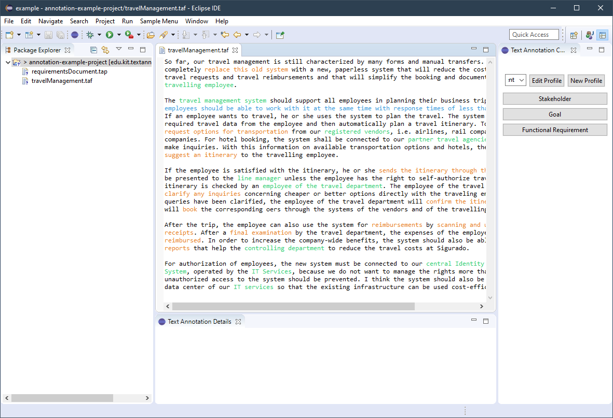

# Eclipse Text Annotation Plugin

## Quick Setup

For now the plugin has to be installed manually. Download the latest ``edu.kit.textannotation.annotationplugin-1.0.0-SNAPSHOT.jar`` file from the most recent [release](https://github.com/lukasbach/textannotation/releases) and place it in ``%eclipse-install-dir%/dropins/plugins``. The ``plugins`` subdirectory might not exist yet and has to be created in this case.

Then start eclipse with the ``-clean`` option for it to load the plugin.

## Examples

The repository comes with an example Eclipse workspace to explore the functions of the plugin. Clone the repository with ``git clone https://github.com/lukasbach/textannotation && cd textannotation/example`` and open an Eclipse workspace at that location. You can then open the file ``annotation-example-project/travelManagement.taf`` in Eclipse with the plugin installed.

## Using the Annotation Perspective

The plugin adds a custom perspective that provides all necessary views for using the plugin. Click the perspective shortcut on the top right or navigate through the menu bar via ``Window > Perspective > Open Perspective`` and open the *Text Annotation Perspective*. This automatically opens the relevant views and adds shortcuts for creating new files.

## Logs

The plugin uses the default logging service of Eclipse. By default, all logs are saved at
``workspace/.metadata/.log`` or ``eclipse/configuration/*.log``. You can also open the logs from within eclipse via ``Window > Show View > PDE Runtime > Error Log``.
Logging granularity can be changed via the ``config.ini`` file of eclipse by adapting the ``eclipse.log.level`` to one of the following: ``INFO``, ``WARNING``, ``ERROR``.

## About
(TODO)

The icon used in the plugin is part of the Silk Iconset by [famfamfam.com](famfamfam.com), and licensec under the [CC Attribution 2.5](http://creativecommons.org/licenses/by/2.5/) license.
